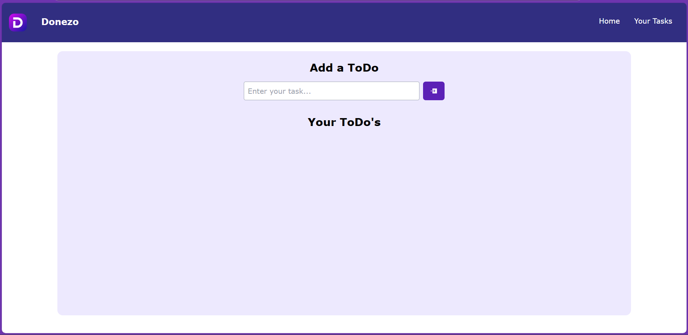
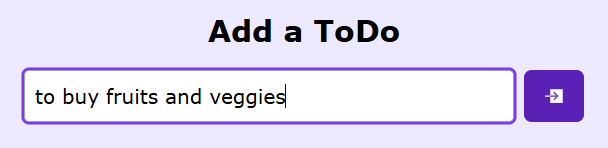
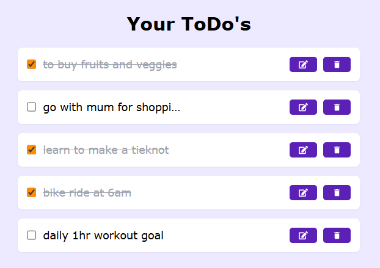
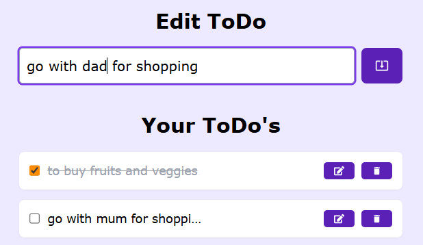
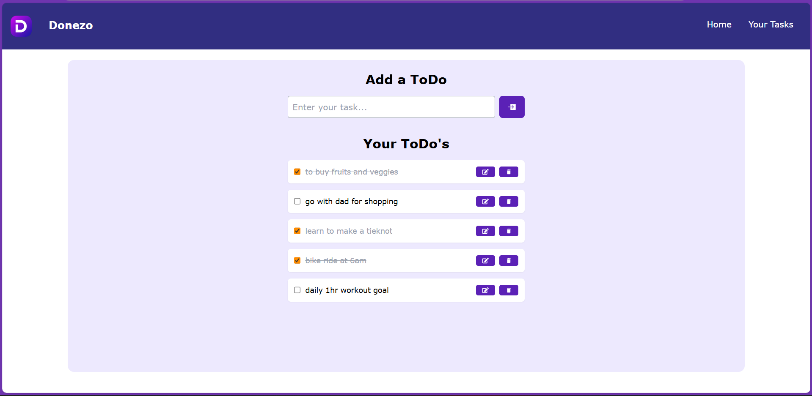

# Donezo

**Manage your daily tasks with a sleek React + Tailwind UI**

> A simple, intuitive to-do app built with React and Tailwind CSS to help you stay organized and focused.

## Table of Contents

* [Live Demo](#live-demo)
* [Features](#features)
* [Tech Stack](#tech-stack)
* [Getting Started](#getting-started)

  * [Prerequisites](#prerequisites)
  * [Installation](#installation)
  * [Running the App](#running-the-app)
* [Project Structure](#project-structure)
* [Usage](#usage)
* [Contributing](#contributing)
* [License](#license)
* [Contact](#contact)

## Live Demo

Check out the live version: [https://donezo-sage.vercel.app](https://donezo-sage.vercel.app)

## Features

* **Add Tasks**: Quickly add new to-do items with titles and optional descriptions.
* **Mark Complete**: Toggle tasks as done or undone to track your progress.
* **Edit & Delete**: Modify task details or remove tasks you no longer need.
* **Filter & Search**: View all, active, or completed tasks and search by keyword.
* **Persistent Storage**: Tasks are saved in your browser’s local storage for offline access.
* **Responsive UI**: Mobile-first design ensures a seamless experience on any device.

## Tech Stack

* **React** (v19) for building the UI
* **Vite** for fast development and bundling
* **Tailwind CSS** for utility-first styling
* **ESLint** & **Prettier** for code linting and formatting
* **LocalStorage API** for data persistence

## Getting Started

### Prerequisites

* Node.js (v18+)
* npm or yarn

### Installation

```bash
# Clone the repository
git clone https://github.com/sahibsiddiqui/Donezo.git
cd Donezo

# Install dependencies
npm install
# or
yarn install
```

### Running the App

```bash
# Start the development server
npm run dev
# or
yarn dev

# Open http://localhost:5174 in your browser
```

## Project Structure

```
Donezo/
├── public/               # Static assets and index.html
├── src/                  # React application source code
│   ├── components/       # UI components (TaskList, TaskItem, etc.)
│   ├── hooks/            # Custom hooks (useLocalStorage, useTasks)
│   ├── utils/            # Utility functions (formatters, filters)
│   ├── App.jsx           # Root component
│   └── main.jsx          # Entry point
├── .gitignore            # Files & folders to ignore
├── package.json          # Project metadata & scripts
├── tailwind.config.js    # Tailwind CSS configuration
├── postcss.config.js     # PostCSS config
├── eslint.config.js      # ESLint rules
└── vite.config.js        # Vite configuration
```

## Usage

1. **Add a Task**: Enter a task title (and optional description) and press Enter or click Add.
2. **Toggle Completion**: Click the checkbox next to a task to mark it complete or incomplete.
3. **Edit or Delete**: Use the pencil icon to edit, or the trash icon to delete a task.
4. **Filter & Search**: Use the filter buttons (All / Active / Completed) or the search bar to find specific tasks.

## Screenshots

- Below are some screenshots illustrating Donezo in action.
  - Dashboard: 

  - Adding a ToDo: 
  - Your ToDos: 
  - Edit a Todo: 
  - Finally it should look like this!: 

## Contributing

- Contributions are welcome! To get started:
    1. Fork the repository
    2. Create a new branch (`git checkout -b feature/YourFeature`)
    3. Commit your changes (`git commit -m 'Add new feature'`)
    4. Push to your branch (`git push origin feature/YourFeature`)
    5. Open a Pull Request

- Please ensure your code is formatted with Prettier and passes ESLint checks before submitting.

## Project Link

- [https://github.com/sahibsiddiqui/Donezo](https://github.com/sahibsiddiqui/Donezo)
